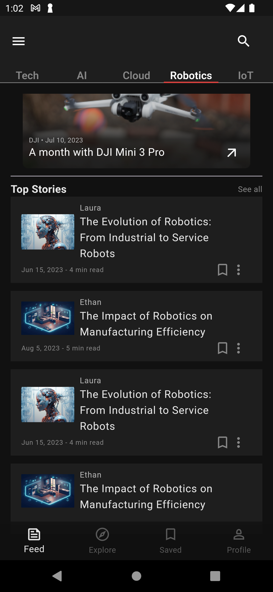
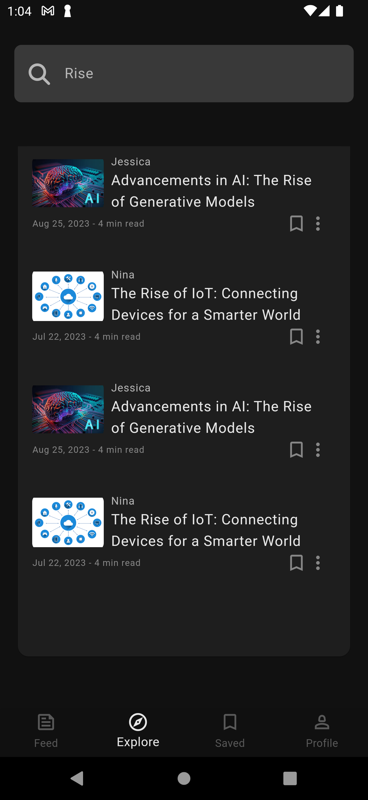
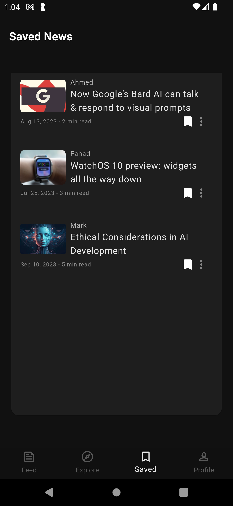
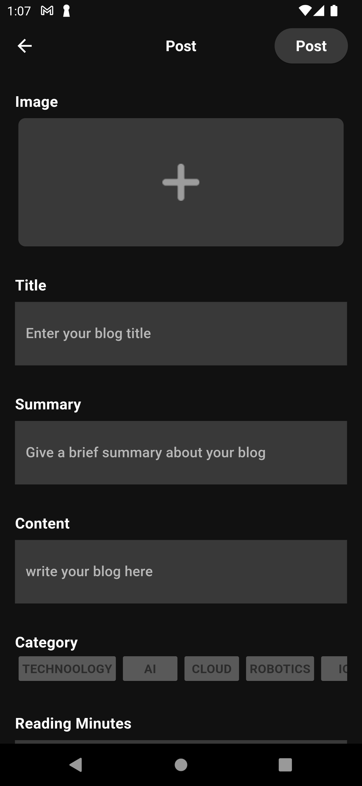

# Blog app

## Description

A blog application that allows users to add, display, and delete blog posts. The app features a search function to find posts and has various post categories.

## Features

- Add post with image
- Edit Post
- Add post to saved list
- Search for posts
- Delete posts

## Work

- Used Encoding and Decoding of Image File to display in app
- Added AlertDialogs on successful or failed operations within the app
- Created MockData to test the app
- Added Logged user to the storage box with the functionality to redirect user to HomeScreen if logged in (Note: a syncronization issue prevented correct load of data for Login check)
- Added search functionality in ExploreScreen, any post title that contains query will be displayed.
- Created class Colours to follow the colors of the design easily.
- Used Intl package to Formate Date of creation of post as displayed in UI

# Screenshots

## Services folder

### get_it.dart
- Get it package is used to locate services from any screen of the app

### get_storage package
- Used as a local database, an instance of type GetStorage is created to store app's data

### extensions
- screen.dart
- For easier access to height and width of MediaQuery

### Models
- Post and User

### Widgets
- category_card
- custom_blog_tile
- custom_post_tile
- custom_navigation
- custome_text_field
- tabBody

### Packages
- get_it: ^7.7.0
- get_storage: ^2.1.1
- icons_plus: ^5.0.0
- image_picker: ^1.1.2
- intl: ^0.19.0

## Help
If you encounter any issues:
- Make sure you have all the necessary dart files within the project
- Contact us so that we can help resolve the problem

## Authors
Abdulaziz Alamri

## Version History
**See commits history for more details**

## Acknowledgments
Tuwaiq Academy

