<p align="center">

<br/>

# Blog App

  This project about create a fully functional Blog App where users can log in, create, update, delete, and view blogs. The app should follow clean code principles and utilize GetIt for dependency injection and GetStorage for managing the login process.

## Requirements

 In order to run the application, this project requires a Dart SDK, Flutter SDK and a command line interface (CML).

## install dart SDK
 install dart SDK from [dart documentation](https://dart.dev/get-dart)

 ## install flutter SDK
 install or upgrade the latest version of Flutter from these installation [guides](https://docs.flutter.dev/get-started/install)

## How to run the project

1. Open terminal or CMD.
2. Navigate to the project path, such as 
```bash
cd /Users/amjadelahi/flutter_bootcamp/Project-5/project5
```
 3. Run the application with a command: 
```bash
flutter run
```
 ## Widgets 
The widgets that are used:

| Widget | Description |
| --- | --- |
| Scaffold | Used to construct the fundamental visual layout structure of the material design |
| Column | Presents the components in a vertical array |
| Text | Displaying and styling text |
| SizedBox | Provide some distance between the two widgets, place an empty Sized Box between them |
| Container | Similar to a box used to store things |
| Padding | Add space around widget |
| Row | Presents the components in a horizental array |
| ElevatedButton | Is a label that, when clicked, takes you to a different screen |
| ListView | Is a collection of widgets that may be scrolled through. |
| SingleChildScrollView | Creates a scrollable area for a single child |
| Image.asset | Used to display images from the assets directory of your project |
| TextField | Used to generate a text input area that accepts input from users |
| ContainedTabBarView | Integrates a TabBar and a TabBarView into a Material widget to create a smooth tabbed user interface |
| ListTile | Used to create a fixed-height row that typically displays a single line of text with an optional leading icon, trailing icon, or subtitle |
| BottomNavigationBar | Provides a bottom navigation bar that allows users to switch between different sections of your app |
| Stack | Allows you to overlay multiple widgets on top of each other |
| TextFormField | Used to create a form field where users can input text. It is highly customizable and provides various properties and methods to handle input validation |
| AlertDialog | Is a type of modal that provides information to the user or prompts for a decision. It’s often used to show messages, confirm actions, or ask for user input |
| RichText | Allows you to display text with multiple styles within a single Text widget|
| PageView | Create a scrollable list of pages|

## External libraries
The External libraries that are used:
1. icons_plus
2.  image_picker
3.  get_it
4.  get_storage
5.  animations

## Output of user

1. Log in screen
<p align="center">
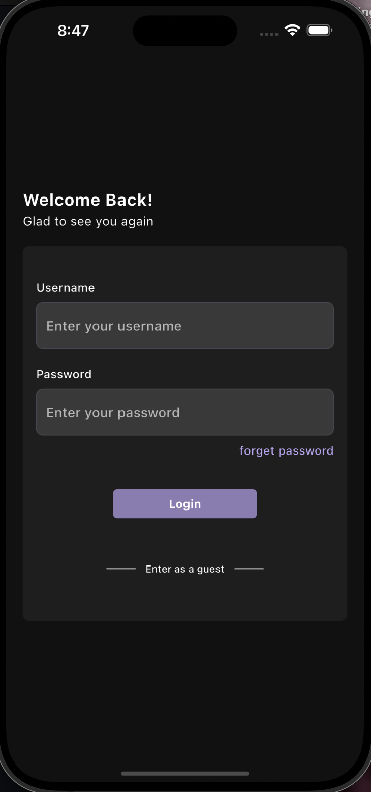
<br/>

2. Home screen
<p align="center">
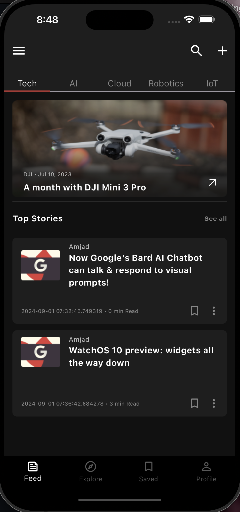
<br/>

3. Blog detail screen
<p align="center">
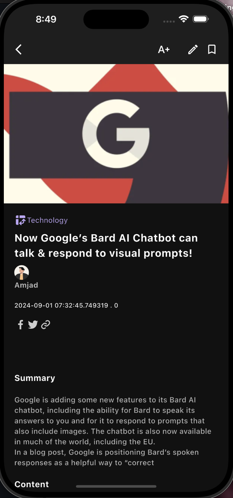
<br/>

4. Add blog detail screen
<p align="center">
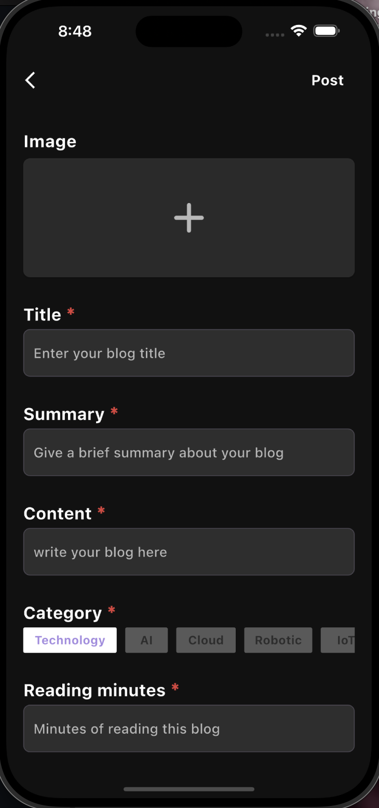
<br/>

5. Edit blog detail screen
<p align="center">
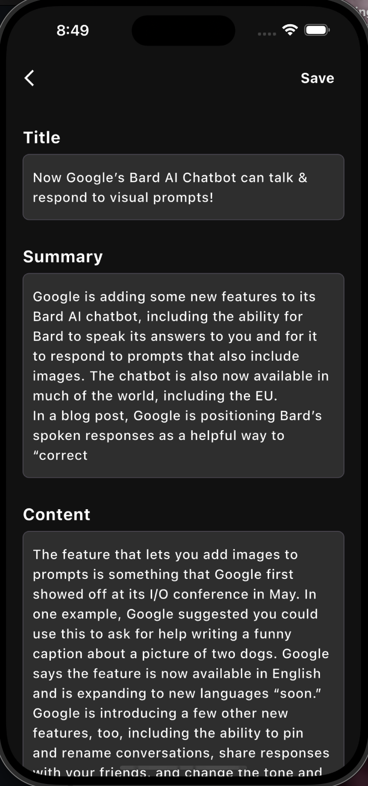
<br/>

6. Explore screen
<p align="center">
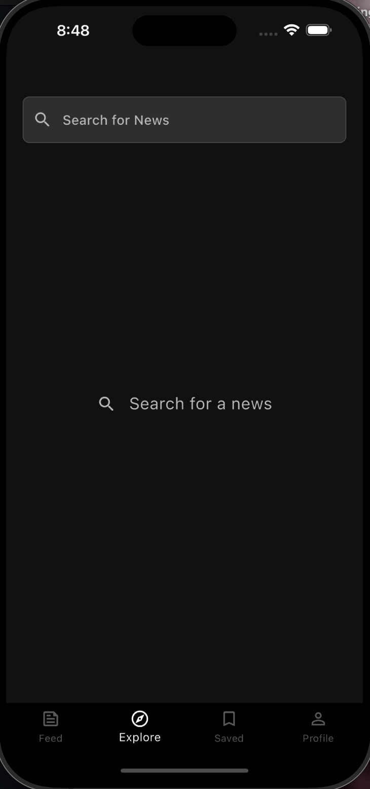
<br/>

7. Saved screen
<p align="center">
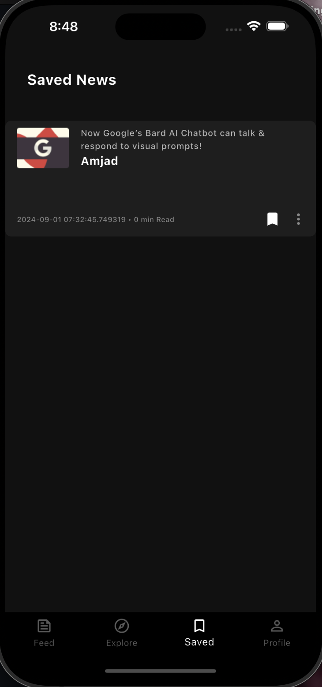
<br/>

8. profile screen
<p align="center">
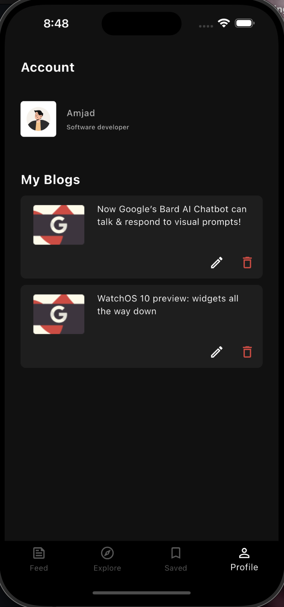
<br/>

## Output of guest user
The app differ from loged in user in these screens:

1. Home screen
<p align="center">
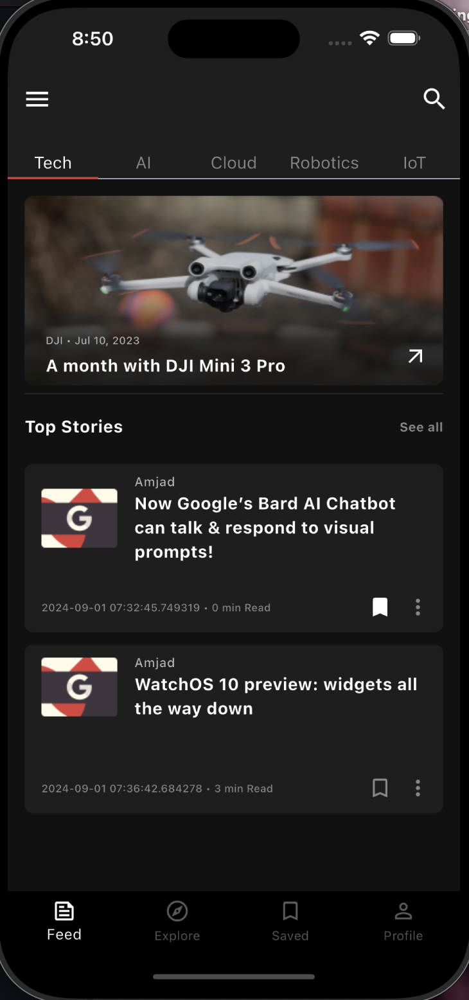
<br/>

2. Profile screen
<p align="center">
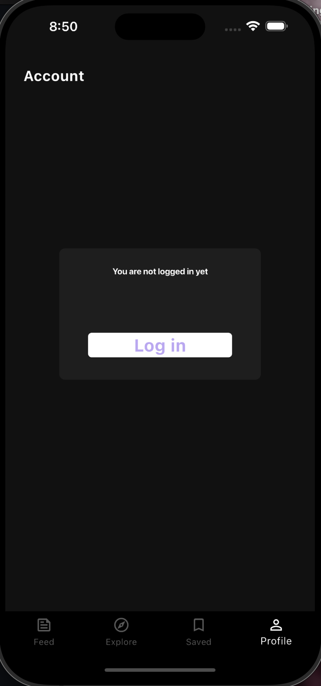
<br/>

3. Geust blog detail
<p align="center">
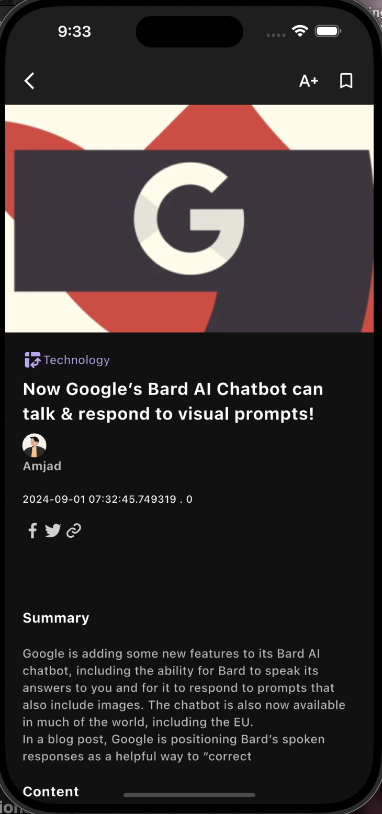
<br/>

## Notes
1. When adding a blog, the image is required to select but not appeared in top stories list (apear default image).

2. When adding a blog, the category section is about an UI (will take the default value "technology").

## Created by
Amjad Noor Elahi


