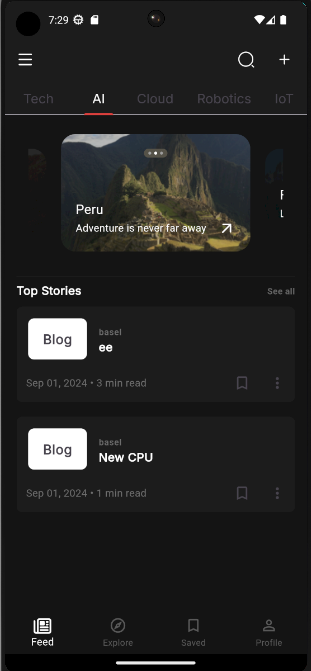
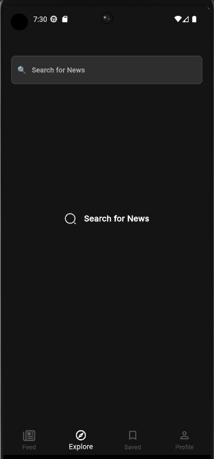
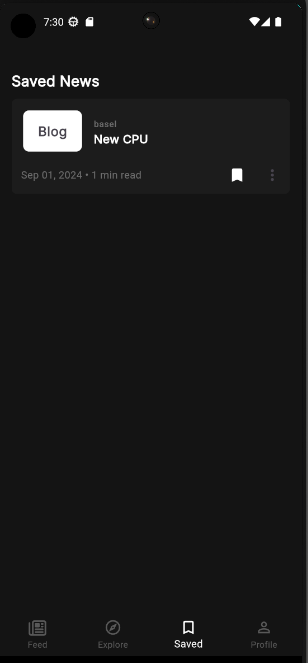
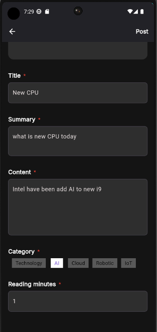

# Blog App 📰

## Overview

### Purpose
The purpose of this app is to Allow user to discover and post manage blogs with more features.

### Features
- Add Blogs: Users can create and post new Blogs.

- Remove Blogs: Users can remove their Blogs.

- Mark Blogs: Users can Mark Blogs.

- Edit Blogs: Users can Edit their Blogs.

- Save User Status : If the user is already logged in, they will be redirected to the Home; otherwise, they will be prompted to log in.

- Local Storage: The app store and update the Blogs localy .

## Widgets & External Packages

### Main Widgets
- **TextField**: The `TextField` widget is used to allow users to input text.

- **SnackBar**: The `SnackBar` is used to show error message to the users.

- **BottomNavigationBar**: The `BottomNavigationBar` is used to navigate between different sections of the app, such as the Feed, Saved Blogs, and profile.

- **BottomSheet**: The `BottomSheet` widget is used to present a sliding panel from the bottom of the screen.

### External Packages
- **get_it**: Is a simple Service Locator for Dart and Flutter projects.

- **get_storage**: A fast, extra light and synchronous key-value in memory, which backs up data to disk at each operation. It is written entirely in Dart and easily integrates with Get framework of Flutter.

- **Icons Plus**: Is a package for Flutter developers that provides a collection of attractive icons from different packs.

- **intl**: For convert Blog Date Format to `('MMM dd, yyyy')`.

- **Image Picker**: A Flutter plugin for iOS and Android for picking images from the image library, and taking new pictures with the camera.

- **carousel_custom_slider**: Is a simple slider package, that can put the position of the indicator and text on it and personalize it.

- **Buttons TabBar**:  Is an open-source Flutter package that provides a tabbar where each tab indicator is a toggle button.

## Instructions for Running the App

### Prerequisites
- Flutter SDK

### Running the App
1. Clone the repository: 
   ```bash
   git clone https://github.com/Basel-75/Project-5.git
2. Navigate to the project directory: 
   ```bash
   cd Project-5

3. Install dependencies: 
   ```bash
   flutter pub get

4. Run the app on an emulator or connected device: 
   ```bash
   flutter run


## Output

### Screenshot






### Demo GIF


## License

This project is licensed under the MIT License - see the [LICENSE](LICENSE) file for details.

## Contact

For more information, feel free to contact me via basel_1422@outlook.com or visit my GitHub profile @Basel-75.