# Project 5 : Blog App ✍️📰

## 1. Overview 📖
In this project, we are supposed to create a blog application using Flutter.

## 2. Key Features 🔑
The app contains a lot of features including but not limited to the following :

**Multi User Support** : The application is fully supported for multi user usage.\
**Post a Blog** : Users can post their own blog in the application.\
**Browse Blogs** : Users can browse all blogs in the application.\
**Edit a Blog** : Users can edit their own blogs.\
**Delete a Blog** : User can delete their own blogs.\
**Search for a Blog** : Users can search for a blog by title.\
**Save Blog** : Users can save blogs for future reference.

## 3. Tools used ⚙️

#### 3.1 Widgets 🎨
widgets used including but not limited to the following :
- **Row & Column** : for grid display purposes.
- **Container** : for sizing and coloring widgets.
- **PageView** : to imitate carousel behaviour.
- **AlertDialog** : for displaying app messages to user.
- **ListView** : for displaying blogs.
- **SizedBox** : mostly for spaces between widgets.
- **TabBar** : mainly for the categories bar
- **TabBarView** : used for displaying the content of each tab bar.
- **NavigationBar** : used for navgating between app main pages.
- **AppBar** : used for easy access to some actions

#### 3.2 Libraries / Packages 📚
Packages used are the following :
- **device_preview** : used for responsivness test.
- **custom_radio_grouped_button** : used for the category selection in add blog process.
- **get_it**: used for globally access some variables and classes.
- **get_storage**: used to store users data.
  **image_picker**: used to allow user to upload image.

## 4. Results ⭐

#### Login Page
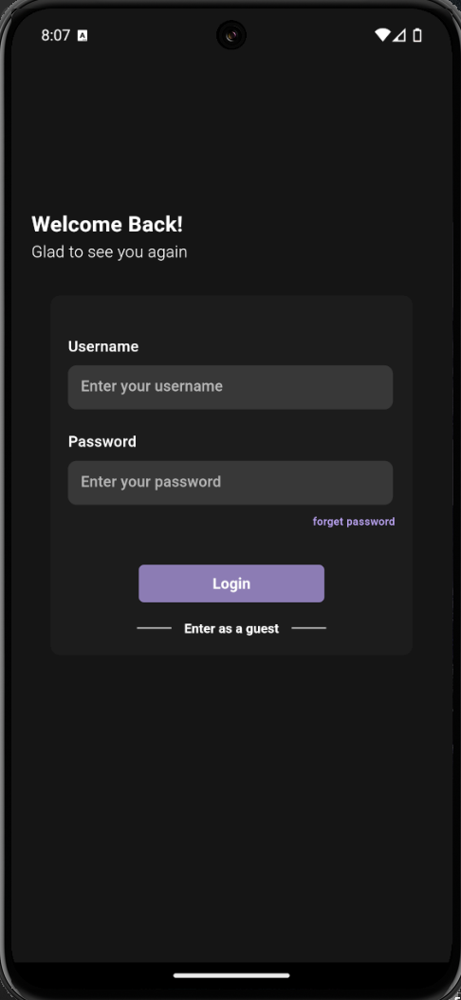

#### Feed Page
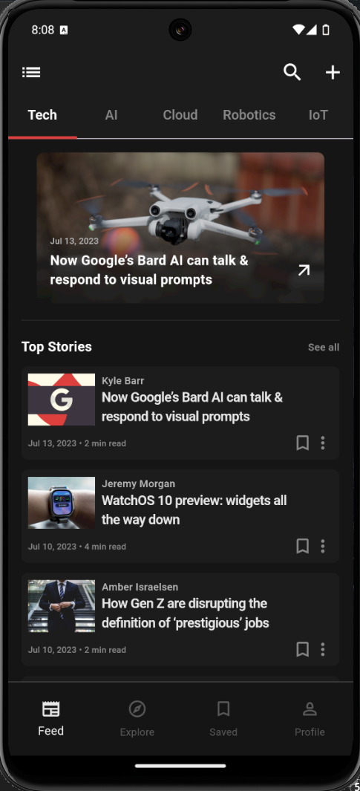

#### Cloud Section Page
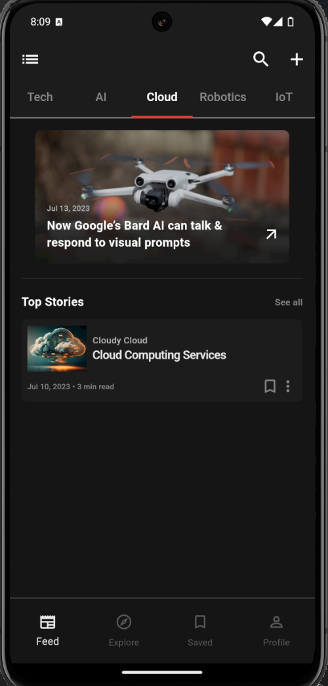

#### View Post Page
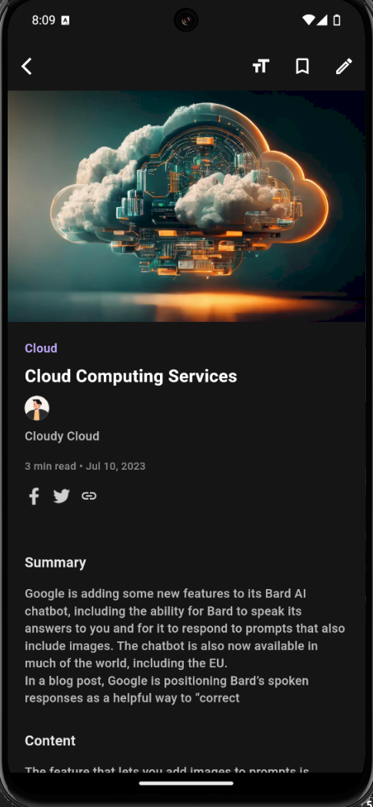

#### Edit Pages
Here is a simple scinario of editing a blog
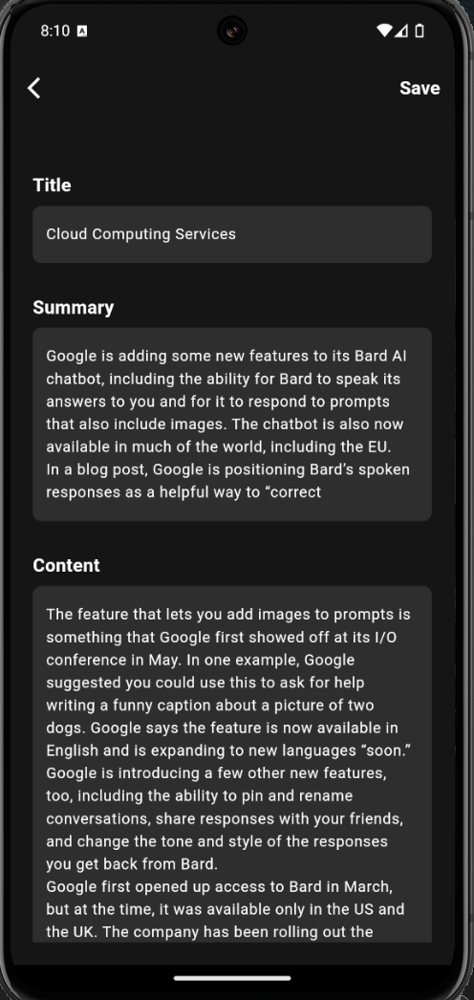

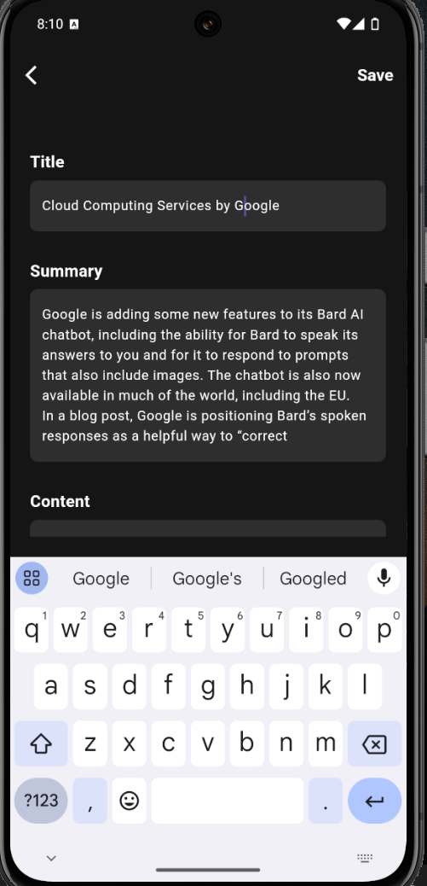

#### Search Page
Search section
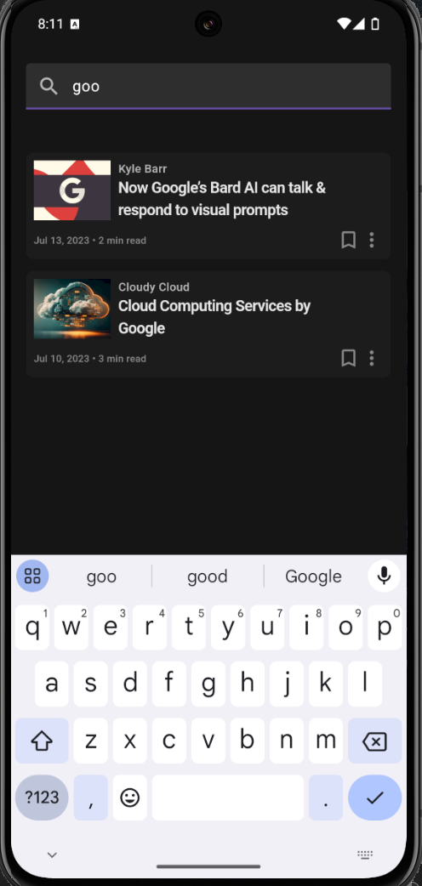

#### Saved Page
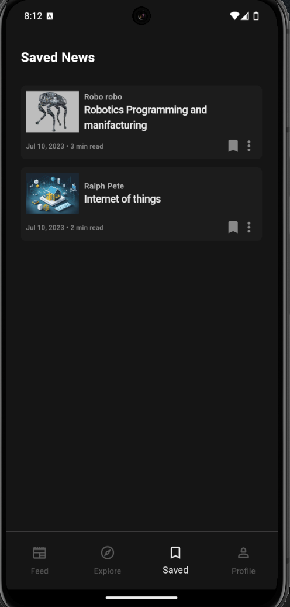

#### Profile Page
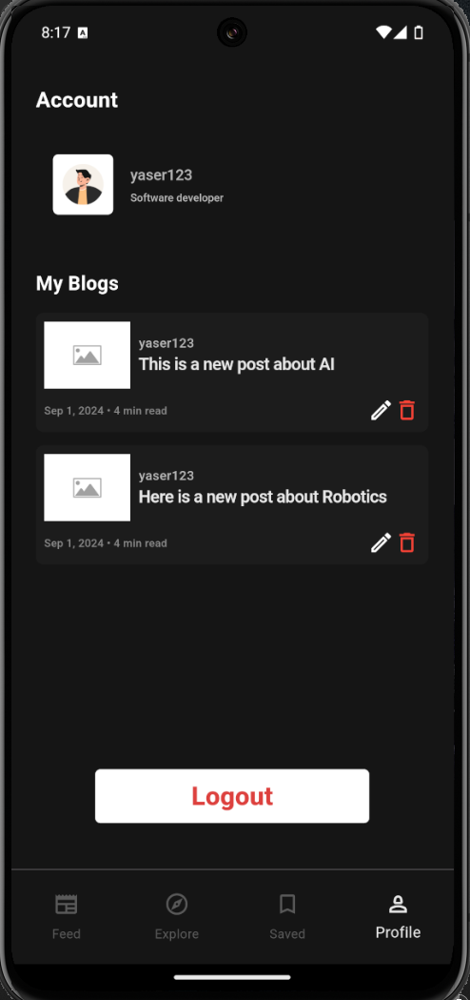

#### Add Blog Page
Here is a simple scinario of adding a blog

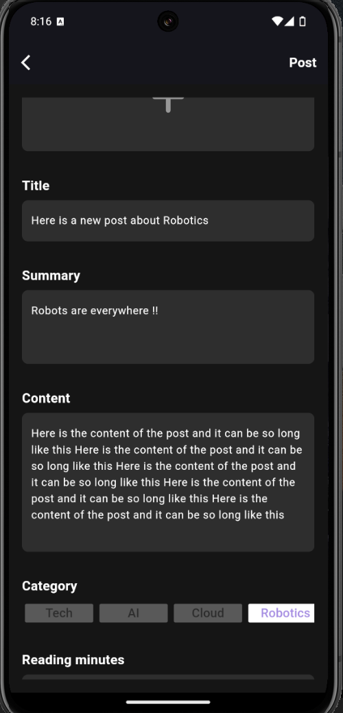

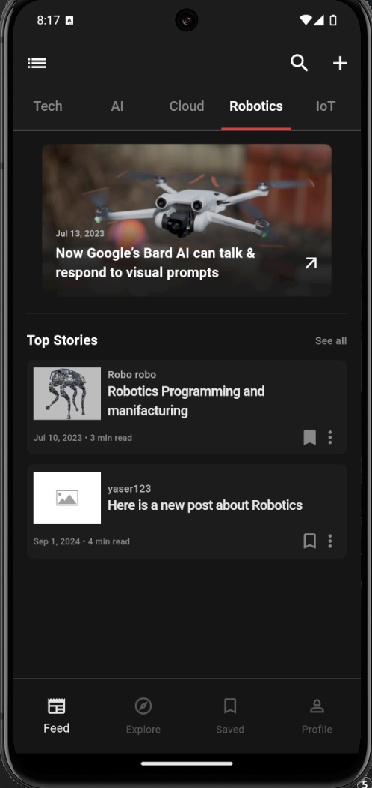

## 5. Conclusion 🏁
In this blog app, users can enjoy reading blogs, posting, managing their own too !

The application has visually appealing interfaces in order to enhance user expeirence.

**Author : Yaser Alkhayyat**