# Project-5

this project has been done with git_it and GetStorage to save data

### pages

- LoginPage : here whee user can login in the system he can chose to be gust are login he olny need to give name and passowrd and will enter the blog

- NavbarPage : will show navbar down and will switch page

- HomePage : seond page after login  will show the user some img slider and the bloog conatnat

- SavedPage : will show up what the user blog he mark

- ExplorePage will show up serch bar 

- ProfilePage : will show if the user login what blog he make and if he gust will ask him to login

-   AddBlogPage will show user page to add blog

- BlogContantPage : show up blog data 

- EditBlogPage will show if the user made this blog to edit it

---

### widget

there is many widget i used but this main ones

-  CategoryButtonWidget() : this is used in add blog page to make user chose one of the
Category if the user click on one of the 5 the other will change color and take the value of the Category the user chose

- BlogCardWidget()  is used to show blog card and used mainly in loop with blogModel 

-  BlogSliderWidget ()  : this where img slider is used the layout is with stack 

      - carousel_slider libry is used to show slider of some img
      - smooth_page_indicator libry to show up the indector in the top

-  FeedTabBodyWidget() is used to show blog data by check of the Category first of each tap 

---

### AppModel

here where all the logic is been used 

- loadData()  : method to load data when user re enter the app agin 

- (all saved method)  : all saved mehtod like saveblogList and the other will do the same thing is to save data when user add ot del data

- userLog() : will login the user after the method check if he new user or not

- isBlogLike mehtod to check of user mark blog or not

---

### img

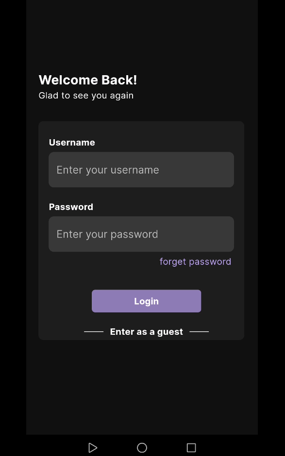

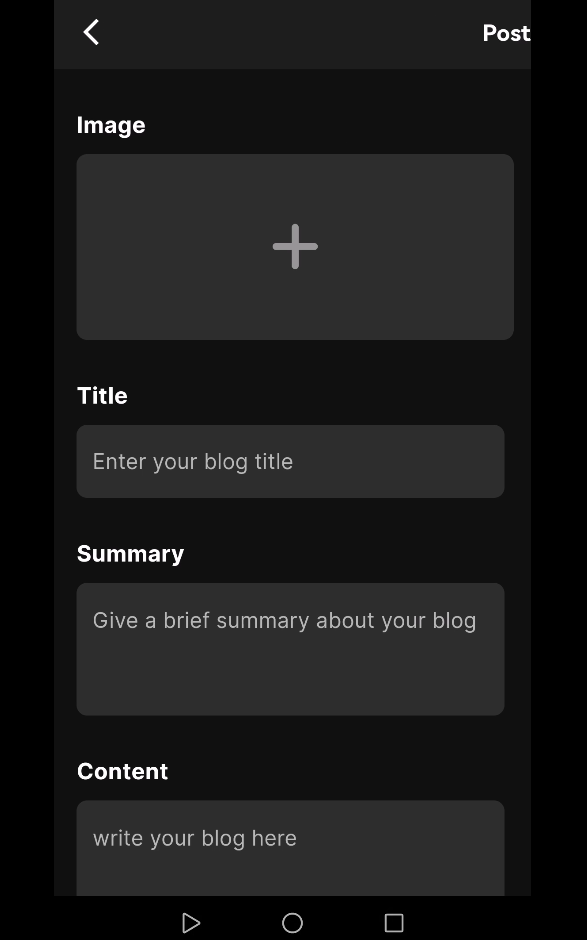
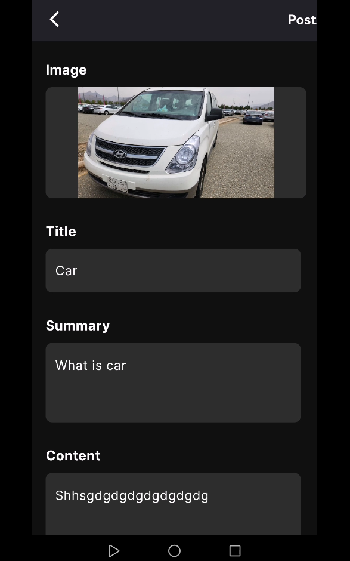
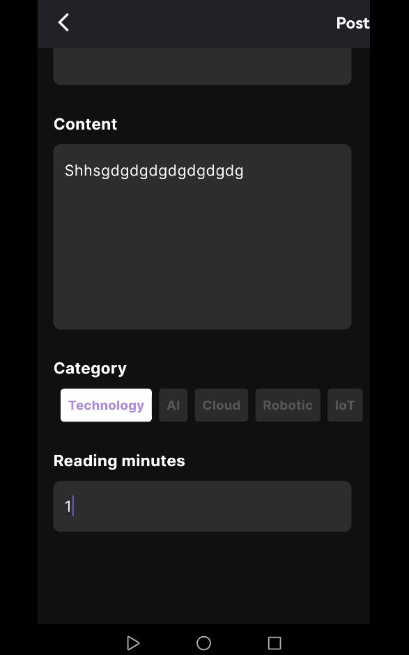

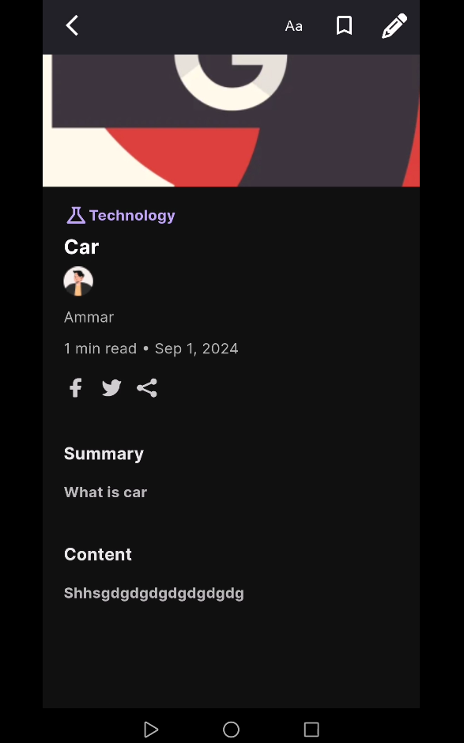
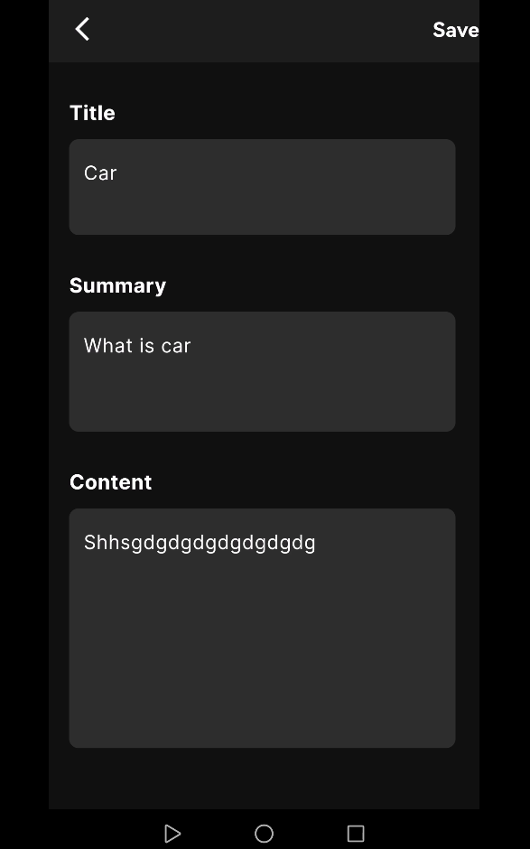

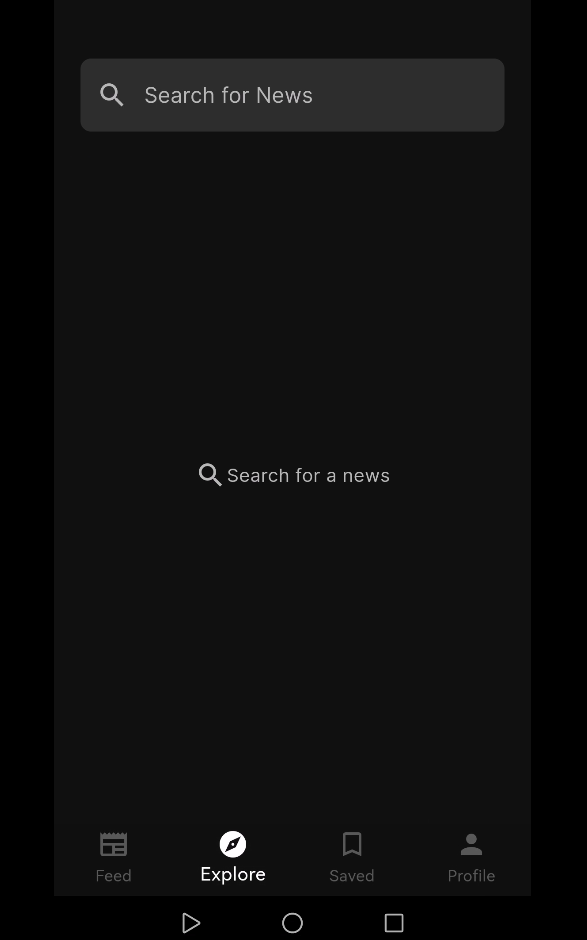

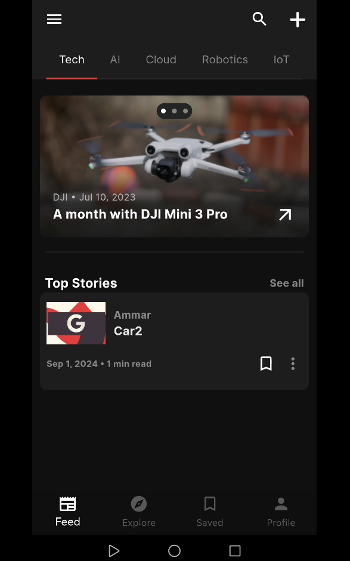
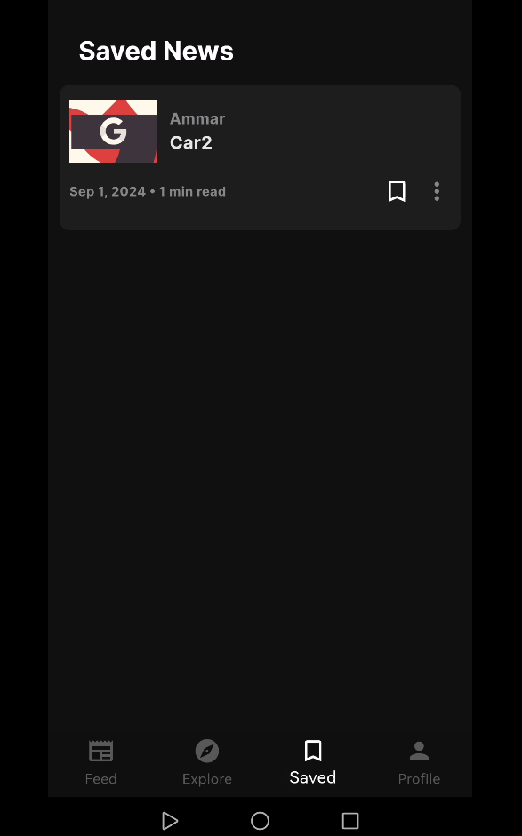

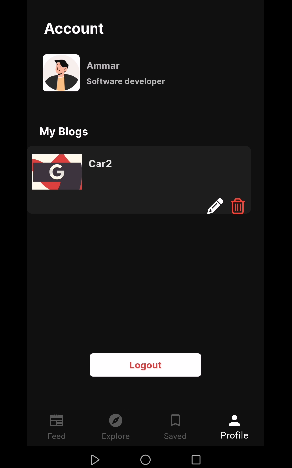

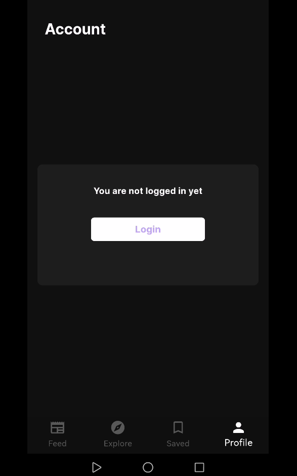

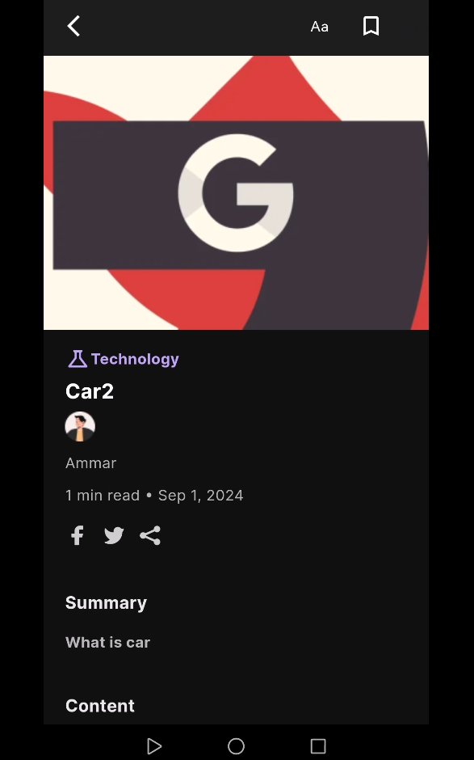
