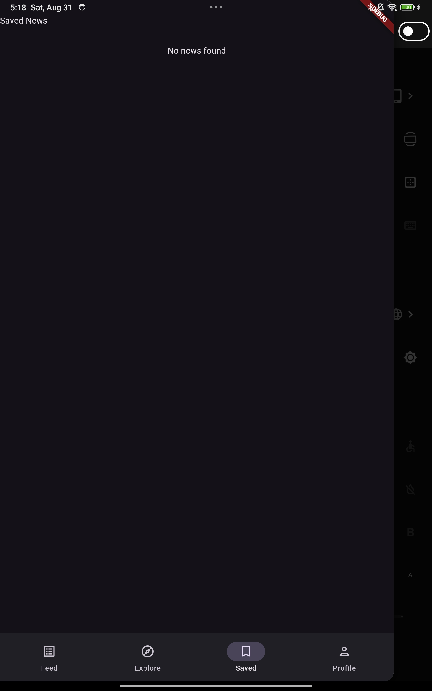

# Project Description: Blog App
app where user can read blogs based on their categories and save theire faverot. if there funcatinality based if the user is log in or not
# Overview
### login page
they can desing if to login as go as gust

  

### fead page
is page the user can see all the blogs based on their categories.
if they log in they can add blog

  
  

### add blog
if the user log in they can add blog 

  
    

### view blog page
if the clck in the blog they view all of details

  

### edit blog page
if the user login they can edit blog 

  
    

### booked mark 
the user can saved their favirot blog 

 
  

### search function 
the user can search based on the title

 
  

### prifle 
the user van view thier profile of the login they also can view their post

 
 

